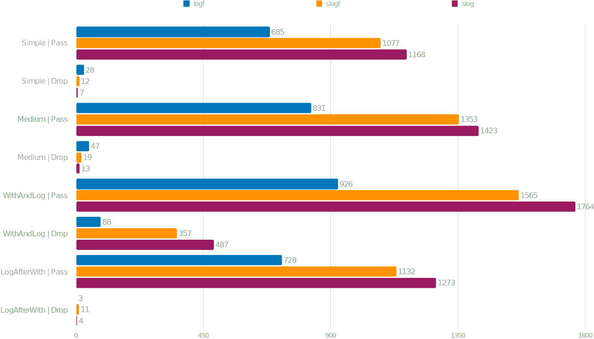
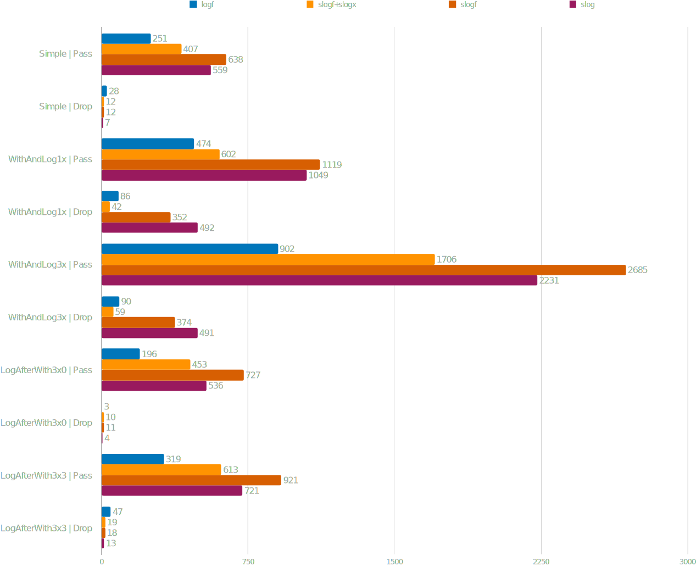

# Benchmark Results

## Combination of (slog.Logger + slogf.Handler) vs (slog.Logger + slog.JSONHandler) and (logf.Logger + JSON encoder) with caller information enabled

Performance of [slogx.Logger](https://pkg.go.dev/github.com/pamburus/slogx#Logger) compared to [slog.Logger](https://pkg.go.dev/log/slog#Logger) with [slog.JSONHandler](https://pkg.go.dev/log/slog#JSONHandler) as a backend.
Logger's [WithLongTerm](https://pkg.go.dev/github.com/pamburus/slogx#Logger.WithLongTerm) method is never used in these tests, so LogAfterWith tests have significant performance degradation.
But at the same time in many other cases especially when the handler is disabled performance is significantly improved. For optimal performance use [WithLongTerm](https://pkg.go.dev/github.com/pamburus/slogx#Logger.WithLongTerm) when the resulting logger is planned to be used more than 3-4 times.
Values are in nanoseconds per operation.

## Combination of (slog.Logger + slogf.Handler) vs (slog.Logger + slog.JSONHandler) and (logf.Logger + JSON encoder) with caller information disabled

Performance of usage of [slog.Logger](https://pkg.go.dev/log/slog#Logger) over [slogf.Handler](https://pkg.go.dev/github.com/pamburus/slogf#Handler) compared to [slog.Logger](https://pkg.go.dev/log/slog#Logger) with [slog.JSONHandler](https://pkg.go.dev/log/slog#JSONHandler) as a backend and pure [logf.Logger](https://pkg.go.dev/github.com/ssgreg/logf#Logger) over a [JSON encoder](https://pkg.go.dev/github.com/ssgreg/logf#NewJSONEncoder) with disabled caller information.
Values are in nanoseconds per operation.

