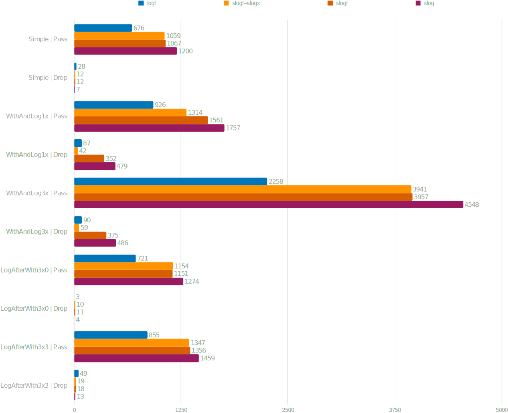

# Benchmark Results

## Several combinations with caller information enabled

Combinations
* [slog.Logger](https://pkg.go.dev/log/slog#Logger) + [slogf.Handler](https://pkg.go.dev/github.com/pamburus/slogf#Handler) over [logf.Logger](https://pkg.go.dev/github.com/ssgreg/logf#Logger) and [JSON encoder](https://pkg.go.dev/github.com/ssgreg/logf#NewJSONEncoder)
* [slogx.Logger](https://pkg.go.dev/github.com/pamburus/slogx#Logger) + [slogf.Handler](https://pkg.go.dev/github.com/pamburus/slogf#Handler) over [logf.Logger](https://pkg.go.dev/github.com/ssgreg/logf#Logger) and [JSON encoder](https://pkg.go.dev/github.com/ssgreg/logf#NewJSONEncoder)
* [slog.Logger](https://pkg.go.dev/log/slog#Logger) + [slog.JSONHandler](https://pkg.go.dev/log/slog#JSONHandler)
* [logf.Logger](https://pkg.go.dev/github.com/ssgreg/logf#Logger) + [JSON encoder](https://pkg.go.dev/github.com/ssgreg/logf#NewJSONEncoder)

Values are in nanoseconds per operation.

## Several combinations with caller information disabled

Combinations
* [slog.Logger](https://pkg.go.dev/log/slog#Logger) + [slogf.Handler](https://pkg.go.dev/github.com/pamburus/slogf#Handler) over [logf.Logger](https://pkg.go.dev/github.com/ssgreg/logf#Logger) and [JSON encoder](https://pkg.go.dev/github.com/ssgreg/logf#NewJSONEncoder)
* [slogx.Logger](https://pkg.go.dev/github.com/pamburus/slogx#Logger) + [slogf.Handler](https://pkg.go.dev/github.com/pamburus/slogf#Handler) over [logf.Logger](https://pkg.go.dev/github.com/ssgreg/logf#Logger) and [JSON encoder](https://pkg.go.dev/github.com/ssgreg/logf#NewJSONEncoder)
* [slog.Logger](https://pkg.go.dev/log/slog#Logger) + [slog.JSONHandler](https://pkg.go.dev/log/slog#JSONHandler)
* [logf.Logger](https://pkg.go.dev/github.com/ssgreg/logf#Logger) + [JSON encoder](https://pkg.go.dev/github.com/ssgreg/logf#NewJSONEncoder)

Values are in nanoseconds per operation.

